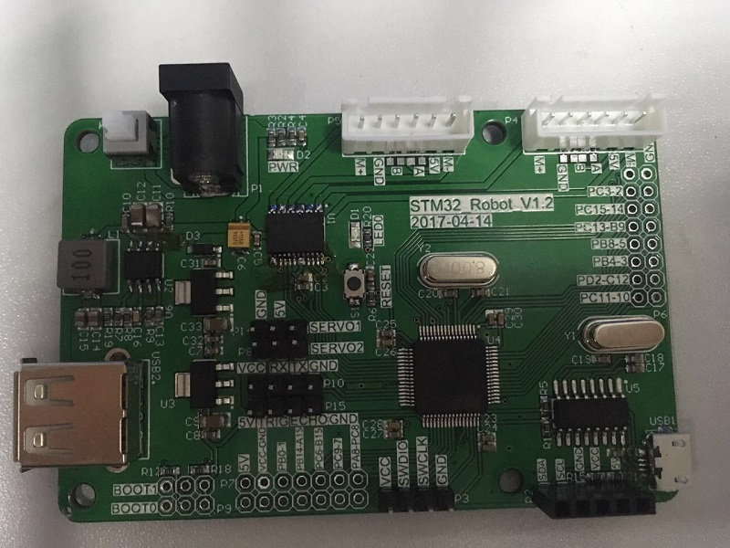
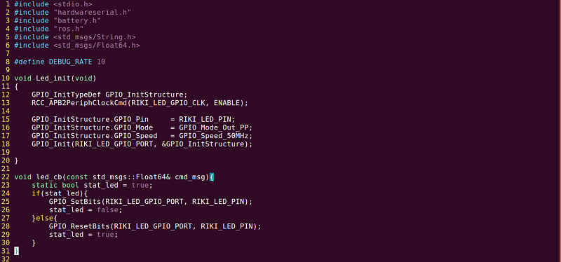
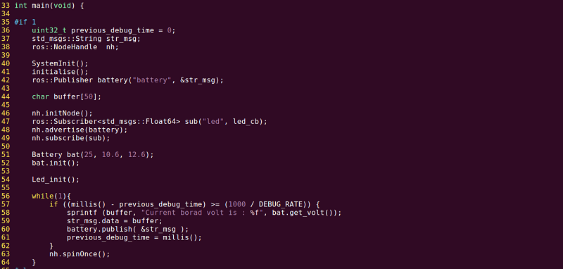
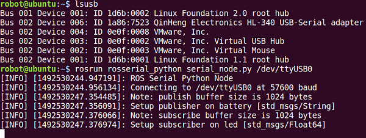
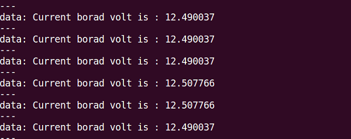

## 淘宝请搜索: ROS STM32 电机驱动板 
## 店铺搜：风野萧萧 


#### 关于stm32下的ROS开发环境介绍说明，此开发环境是在Linux下使用stm32的标准库“STM32F10x_StdPeriph_Driver3.5”，进行stm32开发，整体开发框架已搭建完成，用户开发简单，只需要按自己的方式开发代码即可，它集成了ros_lib，让开发ros底层像arduino一样操作，让广大机友从写stm32解析器结点中解放出来，整体的代码风格如下：  




#### 一、开发环境的配置(ubuntu16.04系统,目前也只支持ubuntu16.04系统) 
* 1、安装编译工具链
> $sudo apt-get  install -y git build-essential  gcc-arm-none-eabi  libstdc++-arm-none-eabi-newlib

如果提示找不到相关安装包，请执行下面操作
> $sudo add-apt-repository ppa:team-gcc-arm-embedded/ppa  
$sudo apt-get update  
$sudo apt-get  install -y git build-essential  gcc-arm-none-eabi  libstdc++-arm-none-eabi-newlib libusb-1.0-0-dev

* 2、安装st-link 烧写器驱动
> $git clone https://github.com/texane/stlink.git  
$ cd stlink  
$ make  
$ cd build/Release  
$ sudo make install

(待测试)
> make PREFIX=/usr/ install

#### 二、怎样添加自己的代码
* 1、往代码目录那面的Src、Bsp、Driver目录下面添加源码后，代码可支持C与C++，编写好代码后，请在Makefile文件中“OBJS  += ./Driver/xxx.o
”的样式添加，其中“xxx”就是你代码的文件名。
* 2、编译程序，进入工程主目录，执行
* 3、如果是添加C代码时，进行混编译，请注意.c中请按下面格式编写代码，请注意只是.c代码需要添加，如果.c文件对应的有.h文件，则只需要在.h文件添加即可，.cpp代码不需要，此处作用，用户可以自己去了解，我就不赘述
```
#ifdef __cplusplus
extern "C" {
#endif

    /*添加自己编写代码区域*/
    
#ifdef __cplusplus
}
#endif
```
> make
* 3、确认st-link驱动是否安装好，插入st-link V2 烧写器，执行下面命令，如果有“STMicroelectronics ST-LINK/V2”，则说明st-link烧写器已被系统识别
> lsusb
* 4、进入工程主目录，执行
> make flash

#### 三、关于项目代码结构
* 1、 Bsp目录，关于驱动的配置与串口的驱动文件都放在此目录
* 2、 Driver目录，关于模块的驱动文件都放在此目录
* 3、Src目录，main程序入口文件放在此目录
* 4、Libs，里面放了ros_lib 与 stm32 标准库


#### 四、关于开发板的测试使用
用户购买到开发板后，一般都是烧写好测试程序的，拿到手后可直接测试，测试流程如下
* 1、用micro usb（一定是能传输数据的usb）将开发板与PC端的ROS系统(indigo以上版本系统,如果是indigo版本系统请先删除系统默认的rosserial包，下载最新的rosserial，重新编译)相连接，连接好后检查是否识别到ttyUSB0，如果有，则说明连接正常，然后打开四个终端依次在每个终端运行  
> $roscore   

运行下面命令，如果连接成功会出现如下图  
>$ rosrun rosserial_python serial_node.py /dev/ttyUSB0  


运行下面命令，则会反馈系统的供电电压值，如下图  
> $ rostopic echo /battery  


运行下面命令，板子上的LED会以0.1s的频率闪烁  
> $ rostopic pub -r 10 led std_msgs/Float64 -- -0.001


#### 五、关于使用中的问题
* 1、“could not open port /dev/ttyUSB0”，此问题是权限问题，请给足串口权限
> $sudo chmod 777 /dev/ttyUSB0

永久解决串口权限问题, 其中riki是你系统的用户名，请替换，然后重启
>sudo usermod -aG dialout riki

* 2、“/dev/ttyUSB0: Input/output error” 此种问题是驱动问题，请安装我提供的驱动，将驱动源码放到ubuntu系统中
> $unzip CH341SER_LINUX.zip  
$ cd CH341SER_LINUX  
$ make  

上面编译后会生ch34x.ko文件，如果你已经能识别usb说明已装了老驱动，此时将它删除，加载新驱动
>$sudo rmmod ch341  
$sudo insmod ch34x.ko

要开机启动时自己加载驱动怎么办？
>$sudo cp ch34x.ko /lib/modules/$(uname -r)/kernel/drivers/usb/serial/  
$sudo depmod  
$sudo rm /lib/modules/$(uname -r)/kernel/drivers/usb/serial/ch341.ko

重启系统后，执行下面命令，如果驱动有ch34x，则说明安装成功
> lsmod | grep ch

#### 六、没有st-link的在linux下用ISP烧写程序
* 1、安装烧写环境
> $sudo apt-get install stm32flash

* 2、用usb串口烧写程序,烧写前请将Boot0设置为高，BOOT1设置为低,main.bin就是你要烧写的二进制文件，请替换，烧写时请按复位后，立即执行下面烧写命令，速度要快，不然会跳转失败，烧完请恢复默认设置。
> $sudo stm32flash -w main.bin -v -g 0x0 /dev/ttyUSB0 -b 115200

